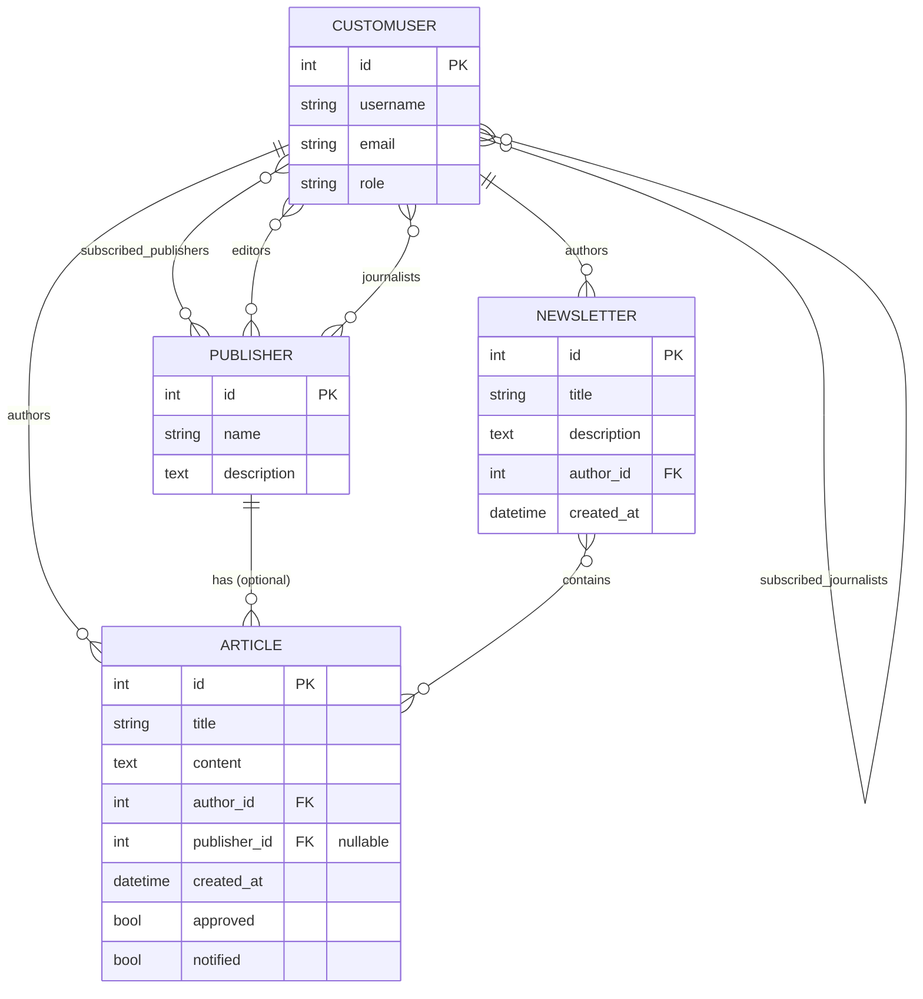
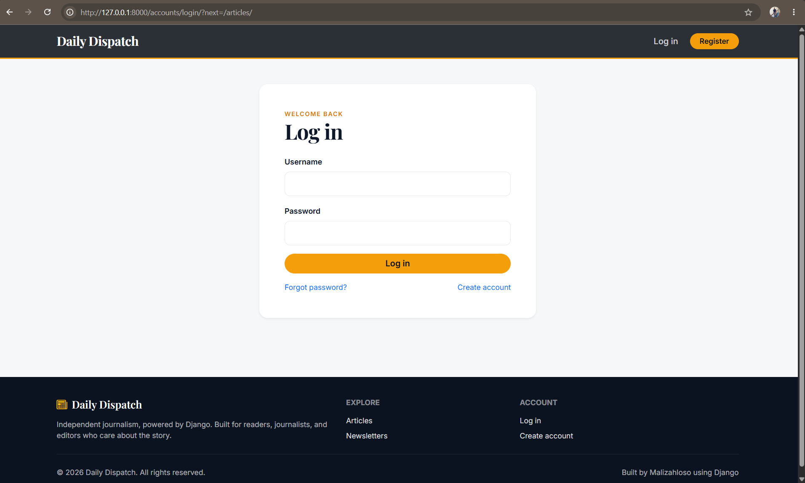
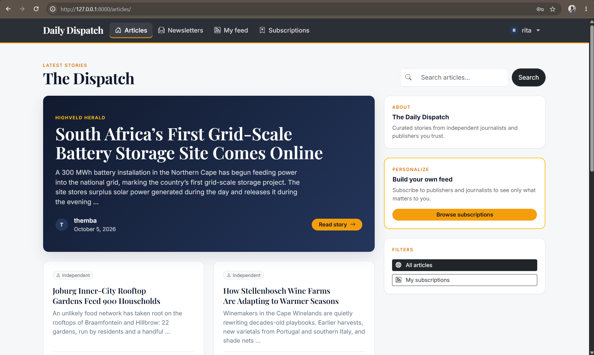
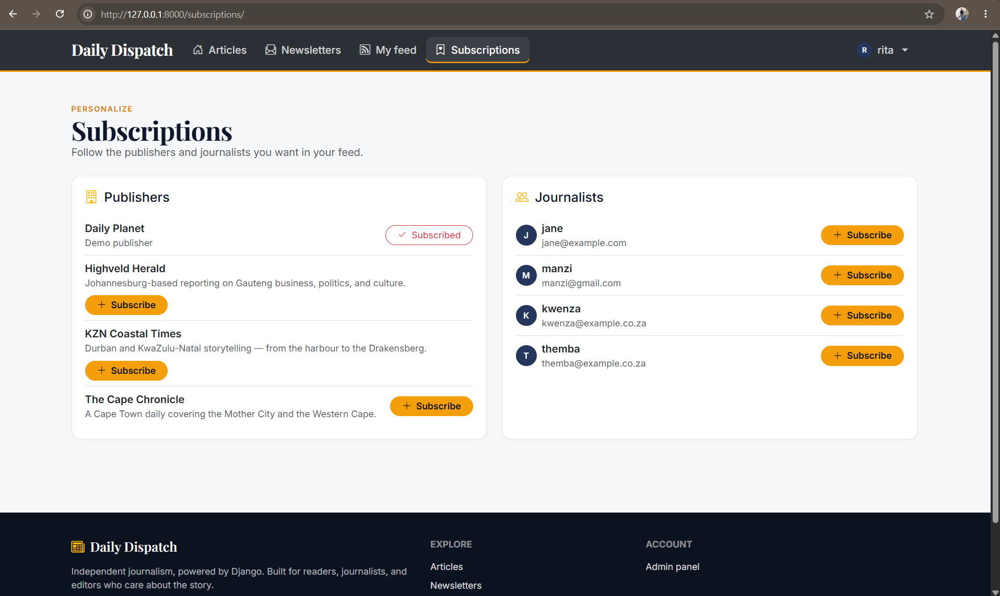
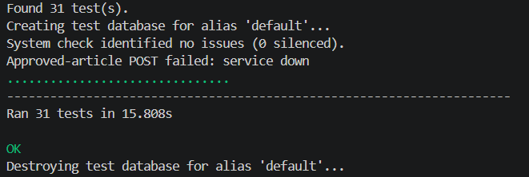

# Daily Dispatch


A Django news platform where journalists publish stories, editors approve them, and readers follow the people and publications they trust. Built as the HyperionDev Partnering with Stellenbosch University capstone project.

When an editor approves an article, every subscriber is emailed and the article is posted to the project's own REST endpoint. This happens exactly once, and a failed email or webhook never blocks the approval.

---

## Contents

1. [Features](#features)
2. [Quick start](#quick-start)
3. [Database setup](#database-setup)
4. [Demo data and accounts](#demo-data-and-accounts)
5. [Using the site](#using-the-site)
6. [Requirements analysis](#requirements-analysis)
7. [Design](#design)
8. [Roles and permissions](#roles-and-permissions)
9. [Approval workflow](#approval-workflow)
10. [REST API](#rest-api)
11. [Testing and code style](#testing-and-code-style)
12. [Configuration](#configuration)
13. [Project structure](#project-structure)
14. [Screenshots](#screenshots)
15. [Troubleshooting](#troubleshooting)

---

## Features

| Role | What they can do |
|---|---|
| **Reader** | Browse approved stories, follow publishers and journalists, get a personal feed, read newsletters |
| **Journalist** | Write articles (independent or under a publisher), build newsletters, manage their own work |
| **Editor** | Review the queue, approve or reject submissions, edit or delete any article |

- Custom user model with a `role`; each role maps to a Django group with specific permissions.
- Approval triggers an email to subscribers and a POST to `/api/approved/` via a Django `post_save` signal.
- REST API with token authentication and role-based authorisation.
- 31 automated unit tests, with email and HTTP calls mocked.
- MariaDB database, normalised to 3NF.

---

## Quick start

```bash
git clone https://github.com/manzezulu/news_capstone.git
cd news_capstone

python -m venv venv
source venv/bin/activate          # Windows: venv\Scripts\activate
pip install -r requirements.txt

# Create the MariaDB database first (see Database setup), then:
python manage.py makemigrations
python manage.py migrate
python manage.py seed_demo     # pre builtdata for testing
python manage.py runserver
```

Open <http://127.0.0.1:8000/> and log in with one of the [demo accounts](#demo-accounts).

**Requirements:** Python 3.11+, MariaDB 10.6+ (or MySQL 8). On Linux, building `mysqlclient` needs `libmariadb-dev pkg-config build-essential`. Bootstrap loads from a CDN, so there is no Node or build step.

| URL | Purpose |
|---|---|
| <http://127.0.0.1:8000/> | The site |
| <http://127.0.0.1:8000/admin/> | Django admin |
| <http://127.0.0.1:8000/api/> | REST API |

---

## Database setup

### MariaDB (required by the brief)

```sql
CREATE DATABASE news_db CHARACTER SET utf8mb4 COLLATE utf8mb4_unicode_ci;
CREATE USER 'news_user'@'localhost' IDENTIFIED BY 'ChangeMe123!';
GRANT ALL PRIVILEGES ON news_db.* TO 'news_user'@'localhost';
GRANT ALL PRIVILEGES ON `test\_news\_db`.* TO 'news_user'@'localhost';
FLUSH PRIVILEGES;
```

```bash
python manage.py migrate
python manage.py createsuperuser
```

## Demo data and accounts

```bash
python manage.py seed_demo            # safe to re-run
```

The seed creates 3 publishers, 6 articles (2 left pending for review), 2 newsletters and 6 users. All demo passwords are **`Mzanzi2026!`**.

### Demo accounts

| Username | Name | Role |
|---|---|---|
| `manzezulu` | Manzezulu Dlamini | Reader |
| `rain` | Rain Mokoena | Reader |
| `kwenza` | Kwenza Ndlovu | Journalist |
| `themba` | Themba Sithole | Journalist |
| `mkhwanazi` | Sipho Mkhwanazi | Editor |
| `simphiwe` | Simphiwe Khumalo | Editor |

### Publishers

| Publisher | Editors | Journalists |
|---|---|---|
| The Cape Chronicle | mkhwanazi | kwenza, themba |
| Highveld Herald | simphiwe | kwenza |
| KZN Coastal Times | mkhwanazi, simphiwe | themba |

### Pre-wired subscriptions

- `manzezulu` follows **The Cape Chronicle** and journalist **kwenza**.
- `rain` follows **KZN Coastal Times** and journalist **themba**.

Both readers have a personalised **My feed** on first login.

---

## Using the site

<details>
<summary><strong>As a reader</strong></summary>

1. Log in as `manzezulu` or `rain`.
2. **Articles** lists everything approved.
3. **Subscriptions** lets you follow or unfollow publishers and journalists.
4. **My feed** shows only stories from who you follow.
5. **Newsletters** lists curated collections.
</details>

<details>
<summary><strong>As a journalist</strong></summary>

1. Log in as `kwenza` or `themba`.
2. Choose **New article**.
3. Pick a publisher you belong to, or leave it blank for an independent story.
4. Save. The article joins the editors' review queue.
5. **My articles** shows your work, including pending pieces.
</details>

<details>
<summary><strong>As an editor</strong></summary>

1. Log in as `mkhwanazi` or `simphiwe`.
2. Open **Review** in the navbar to see every pending article.
3. **Approve** publishes it: subscribers are emailed and the webhook fires.
4. **Reject** removes it from the queue.
5. Any article can be edited or deleted from its page.
</details>

### End-to-end walkthrough

1. Log in as `manzezulu` and subscribe to **Highveld Herald**.
2. Log out, log in as `kwenza`, and create an article under Highveld Herald.
3. Log out, log in as `simphiwe`, open **Review**, and approve it.
4. In the terminal the subscriber email prints, and `approved_articles.log` gains a new line.
5. Log in as `manzezulu`: **My feed** now shows the article.

---

## Requirements analysis

**Functional requirements**

| ID | Requirement |
|---|---|
| FR1 | Users register and log in with exactly one role: Reader, Editor or Journalist |
| FR2 | Each role is placed in a Django group with specific permissions |
| FR3 | Journalists create, view, update and delete articles and newsletters |
| FR4 | Editors view, update, delete and **approve** articles, and manage newsletters |
| FR5 | Readers can only view articles and newsletters |
| FR6 | Readers subscribe to publishers and journalists |
| FR7 | A publisher has many editors and many journalists |
| FR8 | An article is independent (no publisher) or belongs to a publisher |
| FR9 | Approval emails subscribers and POSTs the article to `/api/approved/` |
| FR10 | REST API: list approved, list subscribed, retrieve, create, update, delete |
| FR11 | Token authentication with an `/api/token/` endpoint |
| FR12 | Role-based API authorisation |
| FR13 | Automated Python unit tests |
| FR14 | Database on MariaDB |

**Non-functional requirements**

- PEP 8 compliance, docstrings and descriptive names, modular code.
- Defensive coding: input validation and exception handling around email and HTTP calls.
- Security: access control on every view and endpoint, CSRF protection, hashed passwords, secrets from environment variables.
- Normalised database (3NF).
- Maintainability: tests, README, pinned `requirements.txt`.
- Usability: consistent responsive UI built on Bootstrap 5.

---

## Design

### Entity relationship diagram



**Normalisation (3NF).** Every many-to-many relationship lives in its own join table, publisher details are stored once in `Publisher`, and an article's independent-versus-publisher status is derived from `publisher IS NULL` rather than stored.

### UI/UX plan

| Page | Who | Purpose |
|---|---|---|
| Login / Register | Everyone | Authentication |
| Articles | Logged in | Approved articles; readers also get **My feed** |
| Article detail | Logged in | Read; edit and delete buttons only when permitted |
| My articles | Journalist | Own articles, including pending |
| New / edit article | Journalist, editor | Form |
| Review queue | Editor | Pending articles with Approve and Reject |
| Newsletters | All view; journalists create | List, detail, forms |
| Subscriptions | Reader | Follow and unfollow publishers and journalists |

Navigation links appear only when the user holds the matching permission, messages confirm each action, and deleting requires a confirmation page.

### Design decisions

- **Role field plus derived group.** `role` is the single source of truth; the group is kept in sync on every save, and permissions are granted to groups, never to individual users.
- **Selectors module.** "Approved" and "subscribed" articles are defined once in `selectors.py` and shared by the web views and the API, so they cannot drift apart.
- **Guarded signals.** The approval handler delegates to small testable helpers and wraps email and HTTP calls in `try/except`. A `notified` flag makes it idempotent.
- **Server sets the author.** Both the web form and the API serializer assign `request.user` server-side, so nobody can publish as someone else.
- **Rules enforced in one place.** "Only editors approve" is checked in the serializer, covering POST, PUT and PATCH.

---

## Roles and permissions

Groups are created automatically after `migrate`, and a user's group is re-synced from their `role` on every save.

| Permission | Reader | Journalist | Editor |
|---|:---:|:---:|:---:|
| View articles and newsletters | ✅ | ✅ | ✅ |
| Add article | ❌ | ✅ | ❌ |
| Change article | ❌ | ✅ (own) | ✅ (any) |
| Delete article | ❌ | ✅ (own) | ✅ (any) |
| **Approve article** | ❌ | ❌ | ✅ |
| Add newsletter | ❌ | ✅ | ❌ |
| Change newsletter | ❌ | ✅ (own) | ✅ (any) |
| Delete newsletter | ❌ | ✅ (own) | ✅ (any) |
| Subscribe to publishers and journalists | ✅ | ❌ | ❌ |

Web pages enforce this with `PermissionRequiredMixin`; the API uses a `RolePermission` class that maps HTTP methods to Django model permissions. For non-readers the subscription relations are always kept empty.

---

## Approval workflow

When an editor approves an article:

1. The `post_save` signal on `Article` fires.
2. If the article is not approved, or was already notified, nothing happens.
3. Otherwise the handler:
   - collects the emails of readers subscribed to the article's author or publisher;
   - sends one email per recipient with `send_mass_mail`;
   - POSTs the article to `APPROVED_API_URL` with an `X-Internal-Token` header;
   - sets `notified = True` using `queryset.update()` to avoid re-triggering itself.

Everything is wrapped in `try/except`, so a mail outage or dead webhook never blocks the editor.

**We use the `notified` flag** :`post_save` to fire on every save. Without the flag, editing an approved article would email every subscriber again.

**The webhook.** `POST /api/approved/` is called by the server itself. It rejects any request without the matching `X-Internal-Token` and writes the payload to `approved_articles.log`.

**In production**, move the email and webhook work to a background worker. The signal stays the same and only enqueues a task.

---

## REST API

Authentication is token based. Send the token in a header:

```
Authorization: Token <your-token>
```


| Method | Endpoint | Who | Purpose |
|---|---|---|---|
| POST | `/api/token/` | Anyone | Get an auth token |
| GET | `/api/me/` | Logged in | Your profile |
| GET | `/api/publishers/` | Logged in | List publishers |
| GET | `/api/articles/` | Logged in | Approved articles |
| GET | `/api/articles/?pending=true` | Editors | Pending queue |
| POST | `/api/articles/` | Journalists | Create an article |
| GET | `/api/articles/subscribed/` | Readers | Personal feed |
| GET | `/api/articles/<id>/` | Logged in | One article |
| PUT / PATCH | `/api/articles/<id>/` | Owner or editor | Update (only editors can set `approved`) |
| DELETE | `/api/articles/<id>/` | Owner or editor | Delete |
| GET / POST | `/api/newsletters/` | Any / journalists | List or create |
| GET / PUT / PATCH / DELETE | `/api/newsletters/<id>/` | Owner or editor | Detail or modify |
| POST | `/api/approved/` | Internal | Webhook called on approval |

```bash
# A journalist creates an article
curl -X POST http://127.0.0.1:8000/api/articles/ \
     -H "Authorization: Token <kwenza-token>" \
     -H "Content-Type: application/json" \
     -d '{"title":"Hello","content":"First post","publisher":1}'

# An editor approves it
curl -X PATCH http://127.0.0.1:8000/api/articles/5/ \
     -H "Authorization: Token <mkhwanazi-token>" \
     -H "Content-Type: application/json" \
     -d '{"approved": true}'
```

---

## Testing and code style

```bash
python manage.py test news -v 2
flake8
```

The suite covers:

- **Roles and groups:** users land in the right group; changing role clears subscriptions and swaps the group.
- **Authentication:** valid credentials return a token, bad ones are rejected, anonymous users are blocked.
- **Article API:** readers see only approved articles; journalists cannot self-approve, edit others' work, or publish under a publisher they do not belong to.
- **Subscribed feed:** readers see only their subscriptions; other roles get 403; no subscriptions returns an empty list.
- **Newsletters:** model relations and API permissions per role.
- **Signals:** approval emails only subscribers, posts to the webhook exactly once, and survives email and HTTP failures.
- **Web access:** anonymous users are redirected, readers cannot open the review queue, editors can approve.

All email and HTTP calls are mocked, so tests are fast and never touch the network.
In case you want to push production you can always use the production configurations.

---

## Configuration

Settings are read from environment variables (see `.env.example`).

| Variable | Default | Purpose |
|---|---|---|
| `DJANGO_SECRET_KEY` | `dev-only-change-me` | Django secret key; set your own in production |
| `DJANGO_DEBUG` | `1` | Set to `0` in production |
| `DB_NAME` | `news_db` | MariaDB database name |
| `DB_USER` | `news_user` | MariaDB user |
| `DB_PASSWORD` | `ChangeMe123!` | MariaDB password |
| `DB_HOST` | `127.0.0.1` | MariaDB host |
| `DB_PORT` | `3306` | MariaDB port; change if your server uses another |
| `USE_SQLITE` | unset | Set to `1` to use SQLite instead of MariaDB |
| `APPROVED_API_URL` | `http://127.0.0.1:8000/api/approved/` | Internal webhook target |
| `INTERNAL_API_TOKEN` | `dev-internal-token` | Shared secret for `/api/approved/` |

Never commit real passwords. Recommended `.gitignore`:

```
venv/
__pycache__/
*.pyc
.env
db.sqlite3
staticfiles/
approved_articles.log
```

---

## Project structure

```
news_capstone/
├── manage.py
├── requirements.txt
├── README.md
├── news_project/            # settings and root URLs
├── news/
│   ├── migrations/
│   ├── management/commands/seed_demo.py
│   ├── admin.py
│   ├── api_permissions.py   # RolePermission, IsReader
│   ├── api_urls.py
│   ├── api_views.py
│   ├── apps.py              # connects the post_migrate group setup
│   ├── forms.py
│   ├── models.py            # CustomUser, Publisher, Article, Newsletter
│   ├── selectors.py         # shared read queries
│   ├── serializers.py
│   ├── signals.py           # group sync and approval notifications
│   ├── tests.py
│   ├── urls.py              # web routes
│   └── views.py
├── static/css/app.css
├── templates/
│   ├── base.html
│   ├── partials/
│   ├── registration/        # login.html, register.html
│   └── news/                # article, review, newsletter, subscription pages
└── docs/                    # ERD, wireframes, screenshots
```

---

## Screenshots

Screenshots live in `docs/screenshots/`.







---

## Troubleshooting

<details>
<summary><strong>Migration and database problems</strong></summary>

| Problem | Fix |
|---|---|
| `InconsistentMigrationHistory` mentioning `admin` | You migrated before `AUTH_USER_MODEL` was set. Drop the database, delete `news/migrations/*.py` (keep `__init__.py`), then run `makemigrations` and `migrate`. |
| `mysqlclient` fails to install | On Linux install `libmariadb-dev pkg-config build-essential`. Fallback: `pip install pymysql` and add `import pymysql; pymysql.install_as_MySQLdb()` to `news_project/__init__.py`. |
| `Access denied` when running tests | Grant privileges on `test_news_db` (see Database setup). |
| `no such table` in tests | Models and migrations disagree. Run `python manage.py makemigrations --check --dry-run`, then `makemigrations`. |
</details>

<details>
<summary><strong>Running the site</strong></summary>

| Problem | Fix |
|---|---|
| `TemplateDoesNotExist: registration/login.html` | The `templates/` folder is missing, or `TEMPLATES['DIRS']` does not point at `BASE_DIR / 'templates'`. |
| Site loads with no styling | Check `DEBUG=1`, `django.contrib.staticfiles` in `INSTALLED_APPS`, and that `/static/css/app.css` loads. Hard-refresh with `Ctrl+Shift+R`. |
| Warning about `STATIC_ROOT` or `STATICFILES_DIRS` | Add `STATIC_ROOT = BASE_DIR / 'staticfiles'` and `STATICFILES_DIRS = [BASE_DIR / 'static']`, and create `static/css/`. |
| Log out returns 405 | Django requires POST for logout; use a form with ``. |
</details>

<details>
<summary><strong>Approvals and API</strong></summary>

| Problem | Fix |
|---|---|
| Approving in Django admin sends nothing | `queryset.update()` bypasses signals. Use the admin action that loops and calls `save()`. |
| Emails print but no log line | `runserver` must be running (the signal posts back to itself) and `INTERNAL_API_TOKEN` must match. |
| `/api/articles/subscribed/` returns 404 | In `api_urls.py`, `subscribed/` must come before `<int:pk>/`. |
| A journalist's subscription fields are empty | By design: non-readers' subscriptions are cleared on every save. |
</details>

---

## Author

**Manzezulu Mazibuko**

GitHub:  
https://github.com/manzezulu

LinkedIn:  
https://www.linkedin.com/in/manzezulu-mazibuko-b62a26177/
