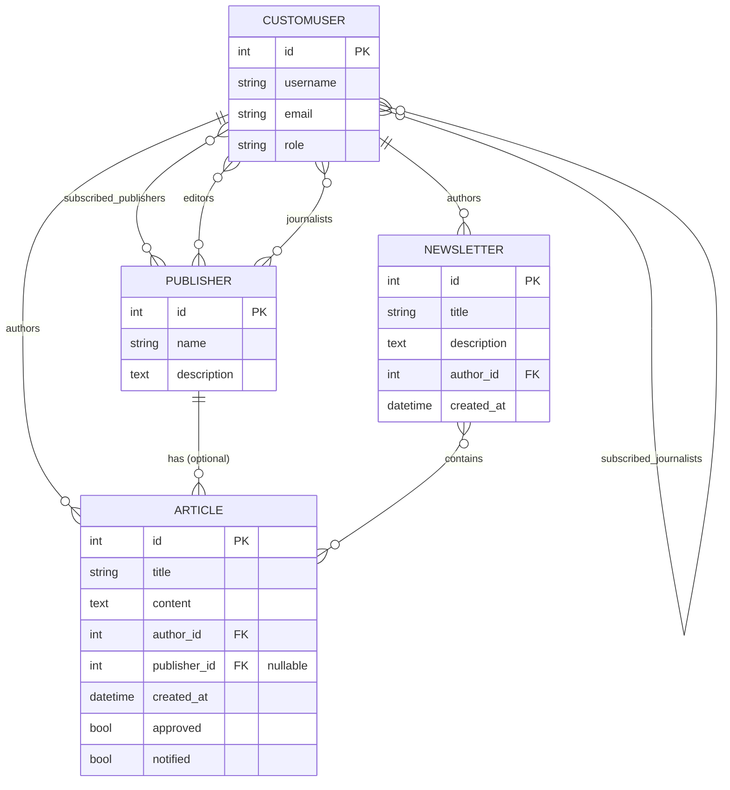

# Entity Relationship Diagram

Normalised to 3NF: every many-to-many relationship is held in its own join table, publisher data lives only in `Publisher`, and an article's independent/publisher status is derived from `publisher IS NULL`.
