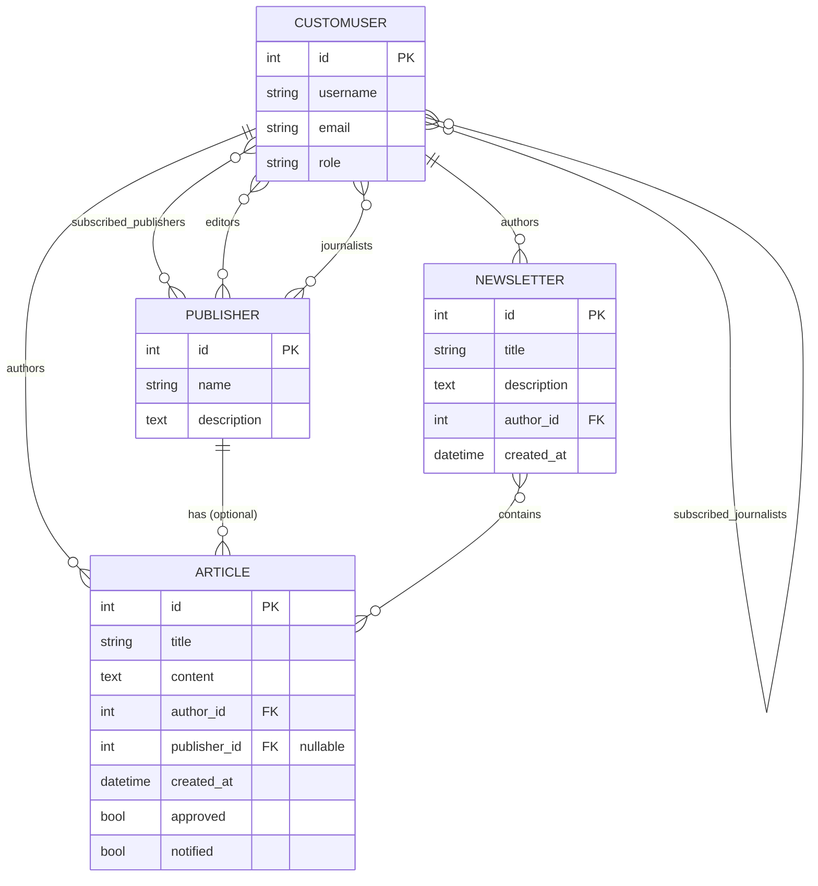

# Capstone Tutorial: Building the Django News Application

A start-to-finish walkthrough of the HyperionDev capstone. Every step says **what** we do and **why**, so you can defend each decision in your review. I chose **Option 1 (Django signals)** for the approval workflow; the Option 2 alternative is shown at the end of section 9.

**Stack:** Python 3.11+, Django 5, Django REST Framework (DRF) with token auth, MariaDB, Bootstrap 5 (CDN), `requests`.

---

## 0. Roadmap

| Step | What we build |
|---|---|
| 1 | Analyse requirements (functional / non-functional) |
| 2 | Design: ERD, normalisation, UI/UX plan |
| 3 | Project + app setup |
| 4 | MariaDB setup and settings |
| 5 | Models, including the custom user |
| 6 | Groups and permissions per role |
| 7 | Admin |
| 8 | Signals: email + POST to `/api/approved/` |
| 9 | Web front end: forms, views, URLs, templates |
| 10 | REST API: serializers, permissions, views, token auth |
| 11 | Automated unit tests |
| 12 | Manual testing (curl / Postman) |
| 13 | PEP 8, documentation, submission checklist |
| 14 | Troubleshooting |

**Suggested order of work:** do sections 1-2 on paper first (the brief explicitly says to design before implementing), then build in the order above and run the app after every section.

---

## 1. Requirements analysis

Read the brief and split it into two lists. Put this in your README.

**Functional requirements (what the system does)**

| ID | Requirement |
|---|---|
| FR1 | Users register/log in and have exactly one role: Reader, Editor or Journalist |
| FR2 | Each role is placed in a Django group with specific permissions |
| FR3 | Journalists create, view, update, delete articles and newsletters |
| FR4 | Editors view, update, delete articles/newsletters and **approve** articles |
| FR5 | Readers can only view articles and newsletters |
| FR6 | Readers subscribe to publishers and to journalists |
| FR7 | A publisher has many editors and many journalists |
| FR8 | An article belongs to a journalist (independent) or to a publisher (publisher content) |
| FR9 | On approval, email subscribers **and** POST the article to our own `/api/approved/` |
| FR10 | REST API: list approved, list subscribed, retrieve, create, update, delete |
| FR11 | Token authentication and `/api/token/` endpoint |
| FR12 | Role-based API authorisation |
| FR13 | Automated Python unit tests |
| FR14 | Database on MariaDB |

**Non-functional requirements (qualities and constraints)**

- PEP 8, comments, descriptive names, modular functions
- Defensive coding: validate input, handle exceptions (email/HTTP failures must never crash an approval)
- Security: access control on every view and endpoint, CSRF, hashed passwords, secrets from environment variables
- Normalised database (3NF)
- Maintainability: tests, README, `requirements.txt`
- Usability: consistent, responsive UI (Bootstrap)

---

## 2. Design

### 2.1 ERD



### 2.2 Normalisation (why this is 3NF)

- **1NF:** every column holds one value. Lists (editors, subscriptions, newsletter articles) are **not** stored in a column; they live in separate join tables Django creates for each `ManyToManyField`.
- **2NF:** join tables have only their two foreign keys; no attribute depends on part of a key.
- **3NF:** no non-key column depends on another non-key column. Publisher details live in `Publisher`, not repeated on every article; the role lives once on the user.
- An article's "independent vs publisher" status is **derived** (`publisher IS NULL`), not stored, so it cannot go out of sync.

### 2.3 UI/UX plan (page map)

| Page | Who | Purpose |
|---|---|---|
| Login / Register | everyone | Auth |
| Articles list (`/articles/`) | logged in | Approved articles; readers get a "My feed" filter |
| Article detail | logged in | Read; edit/delete buttons only if allowed |
| My articles | journalist | Own articles, including pending |
| New/Edit article | journalist / editor | Form |
| Review queue | editor | Pending articles with Approve button |
| Newsletters list/detail/form | all view; journalists create; editors edit | |
| Subscriptions | reader | Subscribe/unsubscribe publishers and journalists |

UX rules: one navbar, links shown by permission (`perms.news.*`), flash messages after actions, confirmation page before deleting, pagination on lists. Sketch these as wireframes (paper photo or Figma) and include them in your submission.

---

## 3. Project and app setup

```bash
mkdir news_capstone && cd news_capstone
python -m venv venv
source venv/bin/activate          # Windows: venv\Scripts\activate
pip install django djangorestframework mysqlclient requests flake8
django-admin startproject news_project .
python manage.py startapp news
```

The brief asks for `django-admin startproject project_name` and `python manage.py startapp appname`; ours are `news_project` and `news`.

> **Critical:** we use a custom user model, so it must be configured **before the first `migrate`**. Changing it later means wiping the database.

---

## 4. MariaDB setup

### 4.1 Install

- **Ubuntu/Debian:** `sudo apt install mariadb-server libmariadb-dev pkg-config build-essential`
- **Windows:** install MariaDB from mariadb.org; `pip install mysqlclient` normally installs a prebuilt wheel.

### 4.2 Create the database and user

```sql
CREATE DATABASE news_db CHARACTER SET utf8mb4 COLLATE utf8mb4_unicode_ci;
CREATE USER 'news_user'@'localhost' IDENTIFIED BY 'ChangeMe123!';
GRANT ALL PRIVILEGES ON news_db.* TO 'news_user'@'localhost';
-- Django's test runner creates and drops "test_news_db", so it needs this too:
GRANT ALL PRIVILEGES ON `test\_news\_db`.* TO 'news_user'@'localhost';
FLUSH PRIVILEGES;
```

### 4.3 `news_project/settings.py`

Edit or add these pieces (keep the rest of the generated file):

```python
import os
from pathlib import Path

BASE_DIR = Path(__file__).resolve().parent.parent

SECRET_KEY = os.environ.get('DJANGO_SECRET_KEY', 'dev-only-change-me')
DEBUG = os.environ.get('DJANGO_DEBUG', '1') == '1'
ALLOWED_HOSTS = ['127.0.0.1', 'localhost']

INSTALLED_APPS = [
    'django.contrib.admin',
    'django.contrib.auth',
    'django.contrib.contenttypes',
    'django.contrib.sessions',
    'django.contrib.messages',
    'django.contrib.staticfiles',
    'rest_framework',
    'rest_framework.authtoken',
    'news',
]

# Use our custom user everywhere (must be set before the first migrate)
AUTH_USER_MODEL = 'news.CustomUser'

# MariaDB uses Django's MySQL backend
DATABASES = {
    'default': {
        'ENGINE': 'django.db.backends.mysql',
        'NAME': os.environ.get('DB_NAME', 'news_db'),
        'USER': os.environ.get('DB_USER', 'news_user'),
        'PASSWORD': os.environ.get('DB_PASSWORD', 'ChangeMe123!'),
        'HOST': os.environ.get('DB_HOST', '127.0.0.1'),
        'PORT': os.environ.get('DB_PORT', '3306'),
        'OPTIONS': {'charset': 'utf8mb4'},
    }
}

# Templates: add a project-level folder for shared templates
TEMPLATES[0]['DIRS'] = [BASE_DIR / 'templates']

# Auth redirects
LOGIN_URL = 'login'
LOGIN_REDIRECT_URL = 'article-list'
LOGOUT_REDIRECT_URL = 'login'

# Email: prints to the terminal in development
EMAIL_BACKEND = 'django.core.mail.backends.console.EmailBackend'
DEFAULT_FROM_EMAIL = 'news@example.com'

# Approval integration (section 8)
APPROVED_API_URL = os.environ.get('APPROVED_API_URL', 'http://127.0.0.1:8000/api/approved/')
INTERNAL_API_TOKEN = os.environ.get('INTERNAL_API_TOKEN', 'dev-internal-token')

# DRF: token auth, login required by default
REST_FRAMEWORK = {
    'DEFAULT_AUTHENTICATION_CLASSES': [
        'rest_framework.authentication.TokenAuthentication',
        'rest_framework.authentication.SessionAuthentication',
    ],
    'DEFAULT_PERMISSION_CLASSES': [
        'rest_framework.permissions.IsAuthenticated',
    ],
}

# The /api/approved/ endpoint writes here
LOGGING = {
    'version': 1,
    'disable_existing_loggers': False,
    'handlers': {
        'approved_file': {
            'class': 'logging.FileHandler',
            'filename': str(BASE_DIR / 'approved_articles.log'),
        },
    },
    'loggers': {
        'news.approved': {'handlers': ['approved_file'], 'level': 'INFO'},
    },
}
```

Why environment variables? Passwords and secrets must not be committed to GitHub, and this project goes on your public portfolio. Add `approved_articles.log`, `venv/` and `__pycache__/` to `.gitignore`.

**Already have SQLite data?** Move it like this:

```bash
python manage.py dumpdata --natural-foreign --natural-primary \
  -e contenttypes -e auth.permission -e admin.logentry -e sessions > data.json
# switch DATABASES to MariaDB, then:
python manage.py migrate
python manage.py loaddata data.json
```

---

## 5. Models (`news/models.py`)

Key design decisions:

- **`role` field + groups:** the role is the single source of truth; the group is derived from it (section 6).
- **Reader vs journalist fields:** the brief says a journalist's reader fields should be `None` and vice versa. A `ManyToManyField` cannot literally be `None`, so we make "None" mean *empty*: `save()` clears the subscription relations for non-readers, and a reader has no articles/newsletters because only journalists can author them.
- **Independent articles:** an article with `publisher = NULL` is independent, exposed through a property.

```python
"""Database models for the news application."""
from django.conf import settings
from django.contrib.auth.models import AbstractUser
from django.core.exceptions import ValidationError
from django.db import models


class Publisher(models.Model):
    """A curated publication with many editors and many journalists."""

    name = models.CharField(max_length=150, unique=True)
    description = models.TextField(blank=True)
    editors = models.ManyToManyField(
        settings.AUTH_USER_MODEL,
        related_name='publishers_edited',
        blank=True,
        limit_choices_to={'role': 'editor'},
    )
    journalists = models.ManyToManyField(
        settings.AUTH_USER_MODEL,
        related_name='publishers_written_for',
        blank=True,
        limit_choices_to={'role': 'journalist'},
    )

    class Meta:
        ordering = ['name']

    def __str__(self):
        return self.name


class CustomUser(AbstractUser):
    """User with a role and role-specific relations."""

    class Role(models.TextChoices):
        READER = 'reader', 'Reader'
        EDITOR = 'editor', 'Editor'
        JOURNALIST = 'journalist', 'Journalist'

    role = models.CharField(
        max_length=20, choices=Role.choices, default=Role.READER
    )

    # Reader-only fields
    subscribed_publishers = models.ManyToManyField(
        Publisher, related_name='subscribers', blank=True
    )
    subscribed_journalists = models.ManyToManyField(
        'self',
        symmetrical=False,
        related_name='journalist_subscribers',
        blank=True,
        limit_choices_to={'role': 'journalist'},
    )

    def save(self, *args, **kwargs):
        """Save, then enforce 'reader fields are empty for non-readers'."""
        super().save(*args, **kwargs)
        if self.role != self.Role.READER:
            self.subscribed_publishers.clear()
            self.subscribed_journalists.clear()

    # Journalist-only helpers (reverse relations from Article / Newsletter)
    @property
    def independent_articles(self):
        """Articles this journalist published without a publisher."""
        return self.articles.filter(publisher__isnull=True)

    @property
    def independent_newsletters(self):
        """Newsletters this journalist published."""
        return self.newsletters.all()

    def __str__(self):
        return f'{self.username} ({self.get_role_display()})'


class Article(models.Model):
    """A news article, independent (no publisher) or under a publisher."""

    title = models.CharField(max_length=200)
    content = models.TextField()
    author = models.ForeignKey(
        settings.AUTH_USER_MODEL,
        on_delete=models.CASCADE,
        related_name='articles',
        limit_choices_to={'role': 'journalist'},
    )
    publisher = models.ForeignKey(
        Publisher,
        on_delete=models.SET_NULL,
        null=True,
        blank=True,
        related_name='articles',
    )
    created_at = models.DateTimeField(auto_now_add=True)
    approved = models.BooleanField(default=False)
    # Guards against sending the approval email/POST more than once
    notified = models.BooleanField(default=False, editable=False)

    class Meta:
        ordering = ['-created_at']
        permissions = [('approve_article', 'Can approve articles')]

    @property
    def is_independent(self):
        return self.publisher_id is None

    def clean(self):
        """Validate author role and publisher membership."""
        if self.author_id and self.author.role != CustomUser.Role.JOURNALIST:
            raise ValidationError('Only journalists can author articles.')
        if (
            self.publisher_id
            and self.author_id
            and not self.publisher.journalists.filter(pk=self.author_id).exists()
        ):
            raise ValidationError(
                'The author is not a journalist at this publisher.'
            )

    def __str__(self):
        return self.title


class Newsletter(models.Model):
    """A curated collection of articles created by a journalist."""

    title = models.CharField(max_length=200)
    description = models.TextField(blank=True)
    created_at = models.DateTimeField(auto_now_add=True)
    author = models.ForeignKey(
        settings.AUTH_USER_MODEL,
        on_delete=models.CASCADE,
        related_name='newsletters',
        limit_choices_to={'role': 'journalist'},
    )
    articles = models.ManyToManyField(
        Article, related_name='newsletters', blank=True
    )

    class Meta:
        ordering = ['-created_at']

    def __str__(self):
        return self.title
```

Also create `news/selectors.py` for queries shared by the web views and the API (one place = no duplicated logic):

```python
"""Reusable article queries."""
from django.db.models import Q

from .models import Article


def approved_articles():
    """All approved articles with related rows pre-loaded."""
    return Article.objects.filter(approved=True).select_related(
        'author', 'publisher'
    )


def subscribed_articles(user):
    """Approved articles from the user's subscribed journalists/publishers."""
    return approved_articles().filter(
        Q(author__in=user.subscribed_journalists.all())
        | Q(publisher__in=user.subscribed_publishers.all())
    ).distinct()
```

---

## 6. Groups and permissions

Django auto-creates `add/change/delete/view` permissions for each model. We add one custom permission, `approve_article` (see `Meta.permissions` above). Then two automatic behaviours:

1. **After every `migrate`:** create the three groups and attach the right permissions.
2. **Every time a user is saved:** put them in the group matching their role.

Both live in `news/signals.py` (section 8 adds the approval handlers to the same file). Start it like this:

```python
"""Signal handlers: role groups and article-approval notifications."""
import logging
from smtplib import SMTPException

import requests
from django.conf import settings
from django.contrib.auth.models import Group, Permission
from django.core.mail import send_mass_mail
from django.db.models import Q
from django.db.models.signals import post_save
from django.dispatch import receiver

from .models import Article, CustomUser

logger = logging.getLogger(__name__)

# Group name -> permission codenames (matches the brief's role table)
ROLE_PERMISSIONS = {
    'Reader': ['view_article', 'view_newsletter'],
    'Editor': [
        'view_article', 'change_article', 'delete_article', 'approve_article',
        'view_newsletter', 'change_newsletter', 'delete_newsletter',
    ],
    'Journalist': [
        'add_article', 'view_article', 'change_article', 'delete_article',
        'add_newsletter', 'view_newsletter', 'change_newsletter',
        'delete_newsletter',
    ],
}


def create_role_groups(sender, **kwargs):
    """Create the role groups and (re)assign their permissions."""
    for group_name, codenames in ROLE_PERMISSIONS.items():
        group, _ = Group.objects.get_or_create(name=group_name)
        permissions = Permission.objects.filter(
            content_type__app_label='news', codename__in=codenames
        )
        group.permissions.set(permissions)


@receiver(post_save, sender=CustomUser)
def sync_role_group(sender, instance, raw=False, **kwargs):
    """Keep the user's group in step with their role."""
    if raw:  # loaddata: skip
        return
    instance.groups.remove(*Group.objects.filter(name__in=ROLE_PERMISSIONS))
    group = Group.objects.filter(name=instance.get_role_display()).first()
    if group:
        instance.groups.add(group)
```

Connect the `post_migrate` hook in `news/apps.py`:

```python
from django.apps import AppConfig
from django.db.models.signals import post_migrate


class NewsConfig(AppConfig):
    default_auto_field = 'django.db.models.BigAutoField'
    name = 'news'

    def ready(self):
        """Import signal handlers and create role groups after migrate."""
        from . import signals
        post_migrate.connect(signals.create_role_groups, sender=self)
```

> The brief lists Editors as able to *view, update, delete* newsletters, but also says newsletters are "edited or created by journalists and editors". I followed the explicit role table. If your marker expects editors to create newsletters too, add `'add_newsletter'` to the Editor list.

### Run the first migration

```bash
python manage.py makemigrations news
python manage.py migrate
python manage.py createsuperuser
```

Check in the admin later that groups **Reader / Editor / Journalist** exist with permissions.

---

## 7. Admin (`news/admin.py`)

```python
"""Admin configuration."""
from django.contrib import admin
from django.contrib.auth.admin import UserAdmin

from .models import Article, CustomUser, Newsletter, Publisher


@admin.register(CustomUser)
class CustomUserAdmin(UserAdmin):
    """Show the role and subscriptions on the user form."""

    fieldsets = UserAdmin.fieldsets + (
        ('News profile', {'fields': (
            'role', 'subscribed_publishers', 'subscribed_journalists')}),
    )
    add_fieldsets = UserAdmin.add_fieldsets + (
        ('News profile', {'fields': ('email', 'role')}),
    )
    list_display = ('username', 'email', 'role', 'is_staff')
    list_filter = UserAdmin.list_filter + ('role',)


@admin.register(Publisher)
class PublisherAdmin(admin.ModelAdmin):
    list_display = ('name',)
    filter_horizontal = ('editors', 'journalists')


@admin.register(Article)
class ArticleAdmin(admin.ModelAdmin):
    list_display = ('title', 'author', 'publisher', 'approved', 'created_at')
    list_filter = ('approved', 'publisher')
    actions = ['approve_selected']

    @admin.action(description='Approve selected articles')
    def approve_selected(self, request, queryset):
        """Loop and save so the approval signal fires for each article."""
        for article in queryset.filter(approved=False):
            article.approved = True
            article.save()


@admin.register(Newsletter)
class NewsletterAdmin(admin.ModelAdmin):
    list_display = ('title', 'author', 'created_at')
    filter_horizontal = ('articles',)
```

Why loop instead of `queryset.update(approved=True)`? `update()` bypasses `save()`, so **no signal fires** and nobody gets emailed.

---

## 8. Approval workflow with signals (Option 1)

Append to `news/signals.py`:

```python
def get_subscriber_emails(article):
    """Emails of readers subscribed to the article's author or publisher."""
    condition = Q(subscribed_journalists=article.author)
    if article.publisher_id:
        condition |= Q(subscribed_publishers=article.publisher)
    return list(
        CustomUser.objects.filter(condition, role=CustomUser.Role.READER)
        .exclude(email='')
        .values_list('email', flat=True)
        .distinct()
    )


def email_subscribers(article):
    """Send the approved article to each subscriber (one email each)."""
    recipients = get_subscriber_emails(article)
    if not recipients:
        return 0
    subject = f'New article: {article.title}'
    body = f'By {article.author.username}\n\n{article.content}'
    messages = tuple(
        (subject, body, settings.DEFAULT_FROM_EMAIL, [email])
        for email in recipients
    )
    try:
        return send_mass_mail(messages, fail_silently=False)
    except (SMTPException, OSError) as error:
        logger.error('Could not email article %s: %s', article.pk, error)
        return 0


def post_to_approved_api(article):
    """POST the approved article to our own /api/approved/ endpoint."""
    payload = {
        'id': article.pk,
        'title': article.title,
        'content': article.content,
        'author': article.author.username,
        'publisher': article.publisher.name if article.publisher else None,
    }
    try:
        response = requests.post(
            settings.APPROVED_API_URL,
            json=payload,
            headers={'X-Internal-Token': settings.INTERNAL_API_TOKEN},
            timeout=5,
        )
        response.raise_for_status()
    except requests.RequestException as error:
        logger.warning('Approved-article POST failed: %s', error)


@receiver(post_save, sender=Article)
def handle_article_approval(sender, instance, raw=False, **kwargs):
    """When an article becomes approved, notify subscribers exactly once."""
    if raw or not instance.approved or instance.notified:
        return
    email_subscribers(instance)
    post_to_approved_api(instance)
    # update() (not save()) so we do not re-trigger this same signal
    Article.objects.filter(pk=instance.pk).update(notified=True)
    instance.notified = True
```

Why each piece exists:

- **`notified` flag:** `post_save` fires on *every* save. Without it, editing an approved article would re-email everyone.
- **`try/except` around email and HTTP:** the brief demands defensive coding. A mail-server outage must not stop an editor approving an article.
- **`timeout=5`:** `requests` waits forever by default.
- **Shared secret header:** the `/api/approved/` endpoint is called by our server, not by a logged-in user, so it checks `X-Internal-Token` instead of a user token.
- **`update()` at the end:** deliberately bypasses signals to avoid infinite recursion.

### Option 2 (no signals), for reference

Delete the `@receiver` line and call the same helpers from the approval view:

```python
def approve_article(request, pk):
    article = get_object_or_404(Article, pk=pk)
    if not article.approved:
        article.approved = True
        article.save()
        email_subscribers(article)
        post_to_approved_api(article)
```

---

## 9. Web front end

### 9.1 Forms (`news/forms.py`)

```python
"""Forms for registration, articles and newsletters."""
from django import forms
from django.contrib.auth.forms import UserCreationForm

from .models import Article, CustomUser, Newsletter


class RegistrationForm(UserCreationForm):
    """Sign-up form that also captures email and role."""

    email = forms.EmailField(required=True)

    class Meta(UserCreationForm.Meta):
        model = CustomUser
        fields = ('username', 'email', 'role')


class ArticleForm(forms.ModelForm):
    """Journalists/editors edit title, content and optional publisher."""

    class Meta:
        model = Article
        fields = ('title', 'content', 'publisher')

    def __init__(self, *args, user, **kwargs):
        super().__init__(*args, **kwargs)
        if user.role == CustomUser.Role.JOURNALIST:
            # Only publishers this journalist belongs to
            self.fields['publisher'].queryset = user.publishers_written_for.all()
        self.fields['publisher'].required = False
        self.fields['publisher'].empty_label = 'Independent (no publisher)'


class NewsletterForm(forms.ModelForm):
    """Newsletter fields with a checkbox list of approved articles."""

    class Meta:
        model = Newsletter
        fields = ('title', 'description', 'articles')
        widgets = {'articles': forms.CheckboxSelectMultiple}

    def __init__(self, *args, **kwargs):
        super().__init__(*args, **kwargs)
        self.fields['articles'].queryset = Article.objects.filter(approved=True)
```

### 9.2 Views (`news/views.py`)

Access control uses **Django permissions** (so group membership really matters):
`PermissionRequiredMixin` for class views, `@permission_required` for functions. `LoginRequiredMixin` is included implicitly because `PermissionRequiredMixin` redirects anonymous users to login.

```python
"""Web views for the news application."""
from django.contrib import messages
from django.contrib.auth.decorators import login_required, permission_required
from django.contrib.auth.mixins import LoginRequiredMixin, PermissionRequiredMixin
from django.core.exceptions import PermissionDenied
from django.db.models import Q
from django.http import Http404
from django.shortcuts import get_object_or_404, redirect, render
from django.urls import reverse_lazy
from django.views.decorators.http import require_POST
from django.views.generic import (
    CreateView, DeleteView, DetailView, ListView, UpdateView,
)

from .forms import ArticleForm, NewsletterForm, RegistrationForm
from .models import Article, CustomUser, Newsletter, Publisher
from .selectors import approved_articles, subscribed_articles


class OwnerOrEditorMixin:
    """Editors reach every object; journalists only their own."""

    def get_queryset(self):
        queryset = super().get_queryset()
        if self.request.user.role == CustomUser.Role.EDITOR:
            return queryset
        return queryset.filter(author=self.request.user)


# ---------- Accounts ----------
class RegisterView(CreateView):
    form_class = RegistrationForm
    template_name = 'registration/register.html'
    success_url = reverse_lazy('login')


# ---------- Articles ----------
class ArticleListView(LoginRequiredMixin, ListView):
    template_name = 'news/article_list.html'
    context_object_name = 'articles'
    paginate_by = 10

    def get_queryset(self):
        user = self.request.user
        wants_feed = self.request.GET.get('feed') == 'subscribed'
        if wants_feed and user.role == CustomUser.Role.READER:
            return subscribed_articles(user)
        return approved_articles()


class MyArticlesView(PermissionRequiredMixin, ListView):
    permission_required = 'news.add_article'  # journalists only
    template_name = 'news/article_list.html'
    context_object_name = 'articles'

    def get_queryset(self):
        return Article.objects.filter(author=self.request.user)


class ArticleDetailView(LoginRequiredMixin, DetailView):
    model = Article
    template_name = 'news/article_detail.html'

    def get_queryset(self):
        queryset = Article.objects.select_related('author', 'publisher')
        if self.request.user.role == CustomUser.Role.EDITOR:
            return queryset
        # Others: approved articles, plus their own drafts
        return queryset.filter(Q(approved=True) | Q(author=self.request.user))


class ArticleCreateView(PermissionRequiredMixin, CreateView):
    model = Article
    form_class = ArticleForm
    permission_required = 'news.add_article'
    template_name = 'news/form.html'
    success_url = reverse_lazy('my-articles')

    def get_form_kwargs(self):
        kwargs = super().get_form_kwargs()
        kwargs['user'] = self.request.user
        return kwargs

    def form_valid(self, form):
        form.instance.author = self.request.user  # never trust client input
        messages.success(self.request, 'Article submitted for review.')
        return super().form_valid(form)


class ArticleUpdateView(PermissionRequiredMixin, OwnerOrEditorMixin, UpdateView):
    model = Article
    form_class = ArticleForm
    permission_required = 'news.change_article'
    template_name = 'news/form.html'
    success_url = reverse_lazy('article-list')

    def get_form_kwargs(self):
        kwargs = super().get_form_kwargs()
        kwargs['user'] = self.request.user
        return kwargs


class ArticleDeleteView(PermissionRequiredMixin, OwnerOrEditorMixin, DeleteView):
    model = Article
    permission_required = 'news.delete_article'
    template_name = 'news/confirm_delete.html'
    success_url = reverse_lazy('article-list')


# ---------- Editor review ----------
class ReviewQueueView(PermissionRequiredMixin, ListView):
    permission_required = 'news.approve_article'  # editors only
    template_name = 'news/review_queue.html'
    context_object_name = 'articles'

    def get_queryset(self):
        return Article.objects.filter(approved=False).select_related(
            'author', 'publisher'
        )


@login_required
@permission_required('news.approve_article', raise_exception=True)
@require_POST
def approve_article(request, pk):
    """Approve an article; the post_save signal emails and POSTs it."""
    article = get_object_or_404(Article, pk=pk)
    if article.approved:
        messages.info(request, 'That article was already approved.')
    else:
        article.approved = True
        article.save()
        messages.success(request, f'"{article.title}" approved and sent out.')
    return redirect('review-queue')


# ---------- Newsletters ----------
class NewsletterListView(PermissionRequiredMixin, ListView):
    model = Newsletter
    permission_required = 'news.view_newsletter'
    template_name = 'news/newsletter_list.html'
    context_object_name = 'newsletters'


class NewsletterDetailView(PermissionRequiredMixin, DetailView):
    model = Newsletter
    permission_required = 'news.view_newsletter'
    template_name = 'news/newsletter_detail.html'


class NewsletterCreateView(PermissionRequiredMixin, CreateView):
    model = Newsletter
    form_class = NewsletterForm
    permission_required = 'news.add_newsletter'
    template_name = 'news/form.html'
    success_url = reverse_lazy('newsletter-list')

    def form_valid(self, form):
        form.instance.author = self.request.user
        return super().form_valid(form)


class NewsletterUpdateView(PermissionRequiredMixin, OwnerOrEditorMixin, UpdateView):
    model = Newsletter
    form_class = NewsletterForm
    permission_required = 'news.change_newsletter'
    template_name = 'news/form.html'
    success_url = reverse_lazy('newsletter-list')


class NewsletterDeleteView(PermissionRequiredMixin, OwnerOrEditorMixin, DeleteView):
    model = Newsletter
    permission_required = 'news.delete_newsletter'
    template_name = 'news/confirm_delete.html'
    success_url = reverse_lazy('newsletter-list')


# ---------- Subscriptions (readers) ----------
@login_required
def subscriptions(request):
    """List publishers/journalists with subscribe/unsubscribe buttons."""
    if request.user.role != CustomUser.Role.READER:
        raise PermissionDenied
    context = {
        'publishers': Publisher.objects.all(),
        'journalists': CustomUser.objects.filter(role=CustomUser.Role.JOURNALIST),
        'my_publisher_ids': set(
            request.user.subscribed_publishers.values_list('pk', flat=True)),
        'my_journalist_ids': set(
            request.user.subscribed_journalists.values_list('pk', flat=True)),
    }
    return render(request, 'news/subscriptions.html', context)


@login_required
@require_POST
def toggle_subscription(request, kind, pk):
    """Subscribe if not subscribed, otherwise unsubscribe."""
    if request.user.role != CustomUser.Role.READER:
        raise PermissionDenied
    if kind == 'publisher':
        target = get_object_or_404(Publisher, pk=pk)
        relation = request.user.subscribed_publishers
    elif kind == 'journalist':
        target = get_object_or_404(
            CustomUser, pk=pk, role=CustomUser.Role.JOURNALIST)
        relation = request.user.subscribed_journalists
    else:
        raise Http404('Unknown subscription type.')

    if relation.filter(pk=target.pk).exists():
        relation.remove(target)
        messages.info(request, f'Unsubscribed from {target}.')
    else:
        relation.add(target)
        messages.success(request, f'Subscribed to {target}.')
    return redirect('subscriptions')
```

Notes worth remembering for your review:

- `form.instance.author = request.user` — the author is set on the server, so nobody can post as someone else.
- `OwnerOrEditorMixin` limits the **queryset**, so a journalist trying another journalist's edit URL gets a 404 rather than seeing anything.
- Approval is `POST`-only with CSRF protection; a `GET` link that changes data is a security smell.

### 9.3 URLs

`news/urls.py`:

```python
"""Web routes."""
from django.urls import path
from django.views.generic import RedirectView

from . import views

urlpatterns = [
    path('', RedirectView.as_view(pattern_name='article-list'), name='home'),
    path('register/', views.RegisterView.as_view(), name='register'),

    path('articles/', views.ArticleListView.as_view(), name='article-list'),
    path('articles/mine/', views.MyArticlesView.as_view(), name='my-articles'),
    path('articles/new/', views.ArticleCreateView.as_view(), name='article-create'),
    path('articles/<int:pk>/', views.ArticleDetailView.as_view(), name='article-detail'),
    path('articles/<int:pk>/edit/', views.ArticleUpdateView.as_view(), name='article-update'),
    path('articles/<int:pk>/delete/', views.ArticleDeleteView.as_view(), name='article-delete'),

    path('review/', views.ReviewQueueView.as_view(), name='review-queue'),
    path('review/<int:pk>/approve/', views.approve_article, name='article-approve'),

    path('newsletters/', views.NewsletterListView.as_view(), name='newsletter-list'),
    path('newsletters/new/', views.NewsletterCreateView.as_view(), name='newsletter-create'),
    path('newsletters/<int:pk>/', views.NewsletterDetailView.as_view(), name='newsletter-detail'),
    path('newsletters/<int:pk>/edit/', views.NewsletterUpdateView.as_view(), name='newsletter-update'),
    path('newsletters/<int:pk>/delete/', views.NewsletterDeleteView.as_view(), name='newsletter-delete'),

    path('subscriptions/', views.subscriptions, name='subscriptions'),
    path('subscriptions/<str:kind>/<int:pk>/toggle/', views.toggle_subscription, name='toggle-subscription'),
]
```

`news_project/urls.py`:

```python
from django.contrib import admin
from django.urls import include, path

urlpatterns = [
    path('admin/', admin.site.urls),
    path('accounts/', include('django.contrib.auth.urls')),  # login, logout, password reset
    path('api/', include('news.api_urls')),
    path('', include('news.urls')),
]
```

### 9.4 Templates

Create `templates/base.html` (project-level), `templates/registration/login.html`, `templates/registration/register.html`, and inside `news/templates/news/`: `article_list.html`, `article_detail.html`, `form.html`, `confirm_delete.html`, `review_queue.html`, `newsletter_list.html`, `newsletter_detail.html`, `subscriptions.html`.

**`templates/base.html`**

```html
<!doctype html>
<html lang="en">
<head>
  <meta charset="utf-8">
  <meta name="viewport" content="width=device-width, initial-scale=1">
  <title>Daily Dispatch</title>
  <link href="https://cdn.jsdelivr.net/npm/bootstrap@5.3.3/dist/css/bootstrap.min.css" rel="stylesheet">
</head>
<body class="bg-light">
<nav class="navbar navbar-expand-lg navbar-dark bg-dark px-3">
  <a class="navbar-brand" href="">Daily Dispatch</a>
  <ul class="navbar-nav me-auto">
    
      <li class="nav-item"><a class="nav-link" href="">Articles</a></li>
      <li class="nav-item"><a class="nav-link" href="">Newsletters</a></li>
      
        <li class="nav-item"><a class="nav-link" href="?feed=subscribed">My feed</a></li>
        <li class="nav-item"><a class="nav-link" href="">Subscriptions</a></li>
      
      
        <li class="nav-item"><a class="nav-link" href="">My articles</a></li>
        <li class="nav-item"><a class="nav-link" href="">New article</a></li>
      
      
        <li class="nav-item"><a class="nav-link" href="">New newsletter</a></li>
      
      
        <li class="nav-item"><a class="nav-link" href="">Review queue</a></li>
      
    
  </ul>
  <div class="d-flex align-items-center gap-2 text-light">
    
      <span>{{ user.username }} ({{ user.get_role_display }})</span>
      <!-- Django 5 logout must be a POST -->
      <form method="post" action="">
        <button class="btn btn-outline-light btn-sm">Log out</button>
      </form>
    
      <a class="btn btn-outline-light btn-sm" href="">Log in</a>
      <a class="btn btn-warning btn-sm" href="">Register</a>
    
  </div>
</nav>

<main class="container py-4">
  
    <div class="alert alert-{{ message.tags|default:'info' }}">{{ message }}</div>
  
  
</main>
</body>
</html>
```

> Django's `success`, `info` and `warning` message tags match Bootstrap's `alert-*` classes, but `error` does not (Bootstrap uses `danger`). Add `MESSAGE_TAGS = {40: 'danger'}` to `settings.py` so error messages show in red.

**`registration/login.html`**

```html


<div class="col-md-5 mx-auto card card-body">
  <h2>Log in</h2>
  <form method="post">
    {{ form.as_p }}
    <button class="btn btn-primary">Log in</button>
  </form>
</div>

```

**`registration/register.html`** is identical with the heading "Register" and button "Create account".

**`news/article_list.html`** (also used by "My articles")

```html


<h1 class="h3 mb-3">Articles</h1>

  <div class="card mb-3"><div class="card-body">
    <h2 class="h5"><a href="">{{ article.title }}</a>
      <span class="badge bg-warning text-dark">Pending</span>
    </h2>
    <p class="text-muted small mb-1">
      By {{ article.author.username }} &middot;
      {{ article.publisher }}Independent
      &middot; {{ article.created_at|date:"d M Y" }}
    </p>
    <p>{{ article.content|truncatewords:30 }}</p>
    
      
        <a class="btn btn-sm btn-outline-secondary" href="">Edit</a>
      
      
        <a class="btn btn-sm btn-outline-danger" href="">Delete</a>
      
    
  </div></div>

  <p>No articles to show.</p>



  <nav>
    <a href="?page={{ page_obj.previous_page_number }}">&laquo; Previous</a>
    Page {{ page_obj.number }} of {{ page_obj.paginator.num_pages }}
    <a href="?page={{ page_obj.next_page_number }}">Next &raquo;</a>
  </nav>


```

**`news/article_detail.html`**

```html


<article class="card card-body">
  <h1>{{ article.title }}</h1>
  <p class="text-muted">By {{ article.author.username }}
    for {{ article.publisher }}
    &middot; {{ article.created_at|date:"d M Y H:i" }}</p>
  <div>{{ article.content|linebreaks }}</div>
</article>

```

**`news/form.html`** (shared by articles and newsletters)

```html


<div class="col-md-8 mx-auto card card-body">
  <h1 class="h4">EditCreate</h1>
  <form method="post">
    {{ form.as_p }}
    <button class="btn btn-primary">Save</button>
    <a class="btn btn-link" href="javascript:history.back()">Cancel</a>
  </form>
</div>

```

**`news/confirm_delete.html`**

```html


<div class="col-md-6 mx-auto card card-body">
  <h1 class="h4">Delete "{{ object }}"?</h1>
  <p>This cannot be undone.</p>
  <form method="post">
    <button class="btn btn-danger">Yes, delete</button>
    <a class="btn btn-link" href="javascript:history.back()">Cancel</a>
  </form>
</div>

```

**`news/review_queue.html`**

```html


<h1 class="h3 mb-3">Articles awaiting approval</h1>
<table class="table bg-white">
  <thead><tr><th>Title</th><th>Author</th><th>Publisher</th><th></th></tr></thead>
  <tbody>
  
    <tr>
      <td><a href="">{{ article.title }}</a></td>
      <td>{{ article.author.username }}</td>
      <td>{{ article.publisher|default:"Independent" }}</td>
      <td class="d-flex gap-2">
        <form method="post" action="">
          <button class="btn btn-success btn-sm">Approve</button>
        </form>
        <a class="btn btn-outline-secondary btn-sm" href="">Edit</a>
        <a class="btn btn-outline-danger btn-sm" href="">Reject</a>
      </td>
    </tr>
  
    <tr><td colspan="4">Nothing to review. 🎉</td></tr>
  
  </tbody>
</table>

```

**`news/newsletter_list.html`**

```html


<h1 class="h3 mb-3">Newsletters</h1>

  <div class="card mb-3"><div class="card-body">
    <h2 class="h5"><a href="">{{ newsletter.title }}</a></h2>
    <p class="text-muted small">By {{ newsletter.author.username }} &middot; {{ newsletter.created_at|date:"d M Y" }}</p>
    <p>{{ newsletter.description }}</p>
    <a class="btn btn-sm btn-outline-secondary" href="">Edit</a>
    <a class="btn btn-sm btn-outline-danger" href="">Delete</a>
  </div></div>
<p>No newsletters yet.</p>

```

**`news/newsletter_detail.html`**

```html


<h1>{{ newsletter.title }}</h1>
<p class="text-muted">{{ newsletter.description }}</p>
<ul class="list-group">
  
    <li class="list-group-item"><a href="">{{ article.title }}</a></li>
  <li class="list-group-item">No articles in this newsletter.</li>
</ul>

```

**`news/subscriptions.html`**

```html


<h1 class="h3">Publishers</h1>
<ul class="list-group mb-4">
  
    <li class="list-group-item d-flex justify-content-between align-items-center">
      {{ publisher.name }}
      <form method="post" action="">
        <button class="btn btn-sm btn-outline-dangerbtn-primary">
          UnsubscribeSubscribe
        </button>
      </form>
    </li>
  
</ul>

<h1 class="h3">Journalists</h1>
<ul class="list-group">
  
    <li class="list-group-item d-flex justify-content-between align-items-center">
      {{ journalist.username }}
      <form method="post" action="">
        <button class="btn btn-sm btn-outline-dangerbtn-primary">
          UnsubscribeSubscribe
        </button>
      </form>
    </li>
  
</ul>

```

---

## 10. REST API

### 10.1 Serializers (`news/serializers.py`)

```python
"""DRF serializers."""
from rest_framework import serializers

from .models import Article, CustomUser, Newsletter, Publisher
from .selectors import approved_articles


class PublisherSerializer(serializers.ModelSerializer):
    class Meta:
        model = Publisher
        fields = ('id', 'name', 'description', 'editors', 'journalists')
        read_only_fields = fields


class UserSerializer(serializers.ModelSerializer):
    class Meta:
        model = CustomUser
        fields = ('id', 'username', 'email', 'role',
                  'subscribed_publishers', 'subscribed_journalists')
        read_only_fields = fields


class ArticleSerializer(serializers.ModelSerializer):
    author_name = serializers.CharField(source='author.username', read_only=True)
    publisher_name = serializers.CharField(
        source='publisher.name', read_only=True, allow_null=True)

    class Meta:
        model = Article
        fields = ('id', 'title', 'content', 'author', 'author_name',
                  'publisher', 'publisher_name', 'created_at', 'approved')
        read_only_fields = ('author', 'created_at')

    def validate_approved(self, value):
        """Only editors may change the approval state."""
        user = self.context['request'].user
        current = self.instance.approved if self.instance else False
        if value != current and user.role != CustomUser.Role.EDITOR:
            raise serializers.ValidationError(
                'Only editors can approve articles.')
        return value

    def validate_publisher(self, publisher):
        """A journalist may only publish under their own publishers."""
        user = self.context['request'].user
        if (
            publisher
            and user.role == CustomUser.Role.JOURNALIST
            and not publisher.journalists.filter(pk=user.pk).exists()
        ):
            raise serializers.ValidationError(
                'You are not a journalist at this publisher.')
        return publisher


class NewsletterSerializer(serializers.ModelSerializer):
    author_name = serializers.CharField(source='author.username', read_only=True)
    articles = serializers.PrimaryKeyRelatedField(
        many=True, queryset=approved_articles(), required=False)

    class Meta:
        model = Newsletter
        fields = ('id', 'title', 'description', 'created_at',
                  'author', 'author_name', 'articles')
        read_only_fields = ('author', 'created_at')
```

Why "approved" is validated in the serializer: it enforces the rule "only editors approve" in **one** place for POST, PUT and PATCH, and it still allows a journalist to edit other fields.

### 10.2 Permissions (`news/api_permissions.py`)

```python
"""Role-based DRF permissions built on Django group permissions."""
from rest_framework.permissions import SAFE_METHODS, BasePermission

from .models import CustomUser


class RolePermission(BasePermission):
    """Map HTTP method -> Django model permission (view/add/change/delete).

    The view declares ``model_name`` ('article' or 'newsletter').
    """

    method_actions = {
        'GET': 'view', 'HEAD': 'view', 'OPTIONS': 'view',
        'POST': 'add', 'PUT': 'change', 'PATCH': 'change', 'DELETE': 'delete',
    }

    def has_permission(self, request, view):
        user = request.user
        if not (user and user.is_authenticated):
            return False
        action = self.method_actions.get(request.method)
        return action is not None and user.has_perm(
            f'news.{action}_{view.model_name}')

    def has_object_permission(self, request, view, obj):
        if request.method in SAFE_METHODS:
            return True
        user = request.user
        # Editors can modify anything; journalists only their own work
        return user.role == CustomUser.Role.EDITOR or obj.author_id == user.id


class IsReader(BasePermission):
    """Only users with the Reader role."""

    def has_permission(self, request, view):
        user = request.user
        return bool(
            user and user.is_authenticated
            and user.role == CustomUser.Role.READER
        )
```

### 10.3 Views (`news/api_views.py`)

```python
"""REST API views."""
import logging

from django.conf import settings
from django.db.models import Q
from rest_framework import generics, status
from rest_framework.permissions import AllowAny, IsAuthenticated
from rest_framework.response import Response
from rest_framework.views import APIView

from .api_permissions import IsReader, RolePermission
from .models import Article, CustomUser, Newsletter, Publisher
from .selectors import approved_articles, subscribed_articles
from .serializers import (
    ArticleSerializer, NewsletterSerializer, PublisherSerializer,
    UserSerializer,
)

approved_logger = logging.getLogger('news.approved')


class ArticleListCreateView(generics.ListCreateAPIView):
    """GET /api/articles/ (approved) and POST /api/articles/ (journalists)."""

    serializer_class = ArticleSerializer
    permission_classes = [RolePermission]
    model_name = 'article'

    def get_queryset(self):
        user = self.request.user
        wants_pending = self.request.query_params.get('pending') == 'true'
        if wants_pending and user.has_perm('news.approve_article'):
            return Article.objects.filter(approved=False)  # editors' queue
        return approved_articles()

    def perform_create(self, serializer):
        serializer.save(author=self.request.user)


class SubscribedArticleListView(generics.ListAPIView):
    """GET /api/articles/subscribed/ - only the reader's subscriptions."""

    serializer_class = ArticleSerializer
    permission_classes = [IsReader]

    def get_queryset(self):
        return subscribed_articles(self.request.user)


class ArticleDetailView(generics.RetrieveUpdateDestroyAPIView):
    """GET/PUT/PATCH/DELETE /api/articles/<id>/."""

    serializer_class = ArticleSerializer
    permission_classes = [RolePermission]
    model_name = 'article'

    def get_queryset(self):
        user = self.request.user
        queryset = Article.objects.select_related('author', 'publisher')
        if user.role == CustomUser.Role.EDITOR:
            return queryset
        return queryset.filter(Q(approved=True) | Q(author=user))


class NewsletterListCreateView(generics.ListCreateAPIView):
    serializer_class = NewsletterSerializer
    permission_classes = [RolePermission]
    model_name = 'newsletter'
    queryset = Newsletter.objects.select_related('author')

    def perform_create(self, serializer):
        serializer.save(author=self.request.user)


class NewsletterDetailView(generics.RetrieveUpdateDestroyAPIView):
    serializer_class = NewsletterSerializer
    permission_classes = [RolePermission]
    model_name = 'newsletter'
    queryset = Newsletter.objects.select_related('author')


class PublisherListView(generics.ListAPIView):
    serializer_class = PublisherSerializer
    permission_classes = [IsAuthenticated]
    queryset = Publisher.objects.all()


class MeView(generics.RetrieveAPIView):
    """GET /api/me/ - the logged-in user's profile."""

    serializer_class = UserSerializer

    def get_object(self):
        return self.request.user


class ApprovedArticleLogView(APIView):
    """POST /api/approved/ - the endpoint our approval signal calls.

    It simulates an external partner: it only accepts calls carrying the
    shared internal token and writes the article to approved_articles.log.
    """

    authentication_classes = []
    permission_classes = [AllowAny]

    def post(self, request):
        if request.headers.get('X-Internal-Token') != settings.INTERNAL_API_TOKEN:
            return Response(
                {'detail': 'Invalid internal token.'},
                status=status.HTTP_403_FORBIDDEN)
        approved_logger.info('Approved article: %s', dict(request.data))
        return Response({'status': 'logged'}, status=status.HTTP_201_CREATED)
```

### 10.4 API URLs (`news/api_urls.py`)

```python
"""API routes, mounted under /api/."""
from django.urls import path
from rest_framework.authtoken.views import obtain_auth_token

from . import api_views

urlpatterns = [
    path('token/', obtain_auth_token, name='api-token'),
    path('me/', api_views.MeView.as_view(), name='api-me'),
    path('publishers/', api_views.PublisherListView.as_view(), name='api-publishers'),
    # 'subscribed/' must come BEFORE '<int:pk>/'
    path('articles/', api_views.ArticleListCreateView.as_view(), name='api-article-list'),
    path('articles/subscribed/', api_views.SubscribedArticleListView.as_view(), name='api-article-subscribed'),
    path('articles/<int:pk>/', api_views.ArticleDetailView.as_view(), name='api-article-detail'),
    path('newsletters/', api_views.NewsletterListCreateView.as_view(), name='api-newsletter-list'),
    path('newsletters/<int:pk>/', api_views.NewsletterDetailView.as_view(), name='api-newsletter-detail'),
    path('approved/', api_views.ApprovedArticleLogView.as_view(), name='api-approved'),
]
```

`/api/token/` accepts `{"username": "...", "password": "..."}` and returns `{"token": "..."}`. Clients then send `Authorization: Token <token>`.

**Authorisation summary (matches the brief):**

| Endpoint | Reader | Journalist | Editor |
|---|---|---|---|
| GET list / detail | ✅ approved | ✅ approved + own | ✅ all |
| GET subscribed | ✅ | 403 | 403 |
| POST | 403 | ✅ | 403 |
| PUT / PATCH / DELETE | 403 | ✅ own only | ✅ any |
| Set `approved` | ❌ | ❌ (400) | ✅ |

---

## 11. Automated unit tests (`news/tests.py`)

The brief wants: auth per role, reader sees only subscribed content, journalist creates, editor approves/deletes, newsletters, and the signal logic **with mocking**, including successes and failures.

```python
"""Unit tests for the news application."""
from unittest.mock import patch

import requests
from django.contrib.auth import get_user_model
from django.urls import reverse
from rest_framework import status
from rest_framework.test import APITestCase

from .models import Article, Newsletter, Publisher

User = get_user_model()
PASSWORD = 'pass12345!'


class NewsTestBase(APITestCase):
    """Shared fixtures: users, publishers, subscriptions and articles."""

    @classmethod
    def setUpTestData(cls):
        make = User.objects.create_user
        cls.publisher = Publisher.objects.create(name='Daily Planet')
        cls.journalist = make('jane', 'jane@example.com', PASSWORD, role='journalist')
        cls.other_journalist = make('omar', 'omar@example.com', PASSWORD, role='journalist')
        cls.stranger = make('sam', 'sam@example.com', PASSWORD, role='journalist')
        cls.editor = make('edna', 'edna@example.com', PASSWORD, role='editor')
        cls.reader = make('rita', 'rita@example.com', PASSWORD, role='reader')
        cls.other_reader = make('rob', 'rob@example.com', PASSWORD, role='reader')

        cls.publisher.journalists.add(cls.journalist)
        cls.publisher.editors.add(cls.editor)
        cls.reader.subscribed_publishers.add(cls.publisher)
        cls.reader.subscribed_journalists.add(cls.other_journalist)

        # notified=True stops the approval signal firing while seeding data
        seed = {'approved': True, 'notified': True}
        cls.publisher_article = Article.objects.create(
            title='Publisher story', content='...', author=cls.journalist,
            publisher=cls.publisher, **seed)
        cls.independent_article = Article.objects.create(
            title='Independent story', content='...', author=cls.other_journalist, **seed)
        cls.unsubscribed_article = Article.objects.create(
            title='Not for Rita', content='...', author=cls.stranger, **seed)
        cls.pending_article = Article.objects.create(
            title='Pending story', content='...', author=cls.journalist,
            publisher=cls.publisher)


class RoleAndGroupTests(NewsTestBase):
    def test_user_is_placed_in_group_for_role(self):
        self.assertEqual(
            list(self.journalist.groups.values_list('name', flat=True)),
            ['Journalist'])
        self.assertEqual(
            list(self.reader.groups.values_list('name', flat=True)), ['Reader'])

    def test_group_permissions(self):
        self.assertTrue(self.editor.has_perm('news.approve_article'))
        self.assertFalse(self.journalist.has_perm('news.approve_article'))
        self.assertTrue(self.journalist.has_perm('news.add_article'))
        self.assertFalse(self.reader.has_perm('news.add_article'))

    def test_changing_role_clears_reader_fields_and_swaps_group(self):
        self.reader.role = 'journalist'
        self.reader.save()
        self.assertEqual(self.reader.subscribed_publishers.count(), 0)
        self.assertEqual(self.reader.subscribed_journalists.count(), 0)
        self.assertEqual(
            list(self.reader.groups.values_list('name', flat=True)),
            ['Journalist'])


class AuthenticationTests(NewsTestBase):
    def test_token_endpoint_returns_token(self):
        response = self.client.post(
            reverse('api-token'),
            {'username': 'rita', 'password': PASSWORD})
        self.assertEqual(response.status_code, status.HTTP_200_OK)
        self.assertIn('token', response.data)

    def test_token_endpoint_rejects_bad_password(self):
        response = self.client.post(
            reverse('api-token'), {'username': 'rita', 'password': 'wrong'})
        self.assertEqual(response.status_code, status.HTTP_400_BAD_REQUEST)

    def test_anonymous_request_is_rejected(self):
        response = self.client.get(reverse('api-article-list'))
        self.assertEqual(response.status_code, status.HTTP_401_UNAUTHORIZED)


class ArticleApiTests(NewsTestBase):
    def test_list_returns_only_approved_articles(self):
        self.client.force_authenticate(self.reader)
        response = self.client.get(reverse('api-article-list'))
        titles = {item['title'] for item in response.data}
        self.assertNotIn('Pending story', titles)
        self.assertEqual(len(titles), 3)

    def test_reader_only_gets_subscribed_content(self):
        self.client.force_authenticate(self.reader)
        response = self.client.get(reverse('api-article-subscribed'))
        titles = {item['title'] for item in response.data}
        self.assertEqual(titles, {'Publisher story', 'Independent story'})

    def test_subscribed_endpoint_is_forbidden_for_non_readers(self):
        self.client.force_authenticate(self.journalist)
        response = self.client.get(reverse('api-article-subscribed'))
        self.assertEqual(response.status_code, status.HTTP_403_FORBIDDEN)

    def test_reader_with_no_subscriptions_gets_empty_list(self):
        self.client.force_authenticate(self.other_reader)
        response = self.client.get(reverse('api-article-subscribed'))
        self.assertEqual(response.data, [])

    def test_reader_cannot_see_pending_article(self):
        self.client.force_authenticate(self.reader)
        url = reverse('api-article-detail', args=[self.pending_article.pk])
        self.assertEqual(self.client.get(url).status_code, status.HTTP_404_NOT_FOUND)

    def test_journalist_can_create_article(self):
        self.client.force_authenticate(self.journalist)
        response = self.client.post(
            reverse('api-article-list'),
            {'title': 'New', 'content': 'Body', 'publisher': self.publisher.pk},
            format='json')
        self.assertEqual(response.status_code, status.HTTP_201_CREATED)
        article = Article.objects.get(pk=response.data['id'])
        self.assertEqual(article.author, self.journalist)
        self.assertFalse(article.approved)

    def test_reader_cannot_create_article(self):
        self.client.force_authenticate(self.reader)
        response = self.client.post(
            reverse('api-article-list'),
            {'title': 'Nope', 'content': 'Body'}, format='json')
        self.assertEqual(response.status_code, status.HTTP_403_FORBIDDEN)

    def test_journalist_cannot_publish_under_foreign_publisher(self):
        other = Publisher.objects.create(name='Other Press')
        self.client.force_authenticate(self.journalist)
        response = self.client.post(
            reverse('api-article-list'),
            {'title': 'X', 'content': 'Y', 'publisher': other.pk}, format='json')
        self.assertEqual(response.status_code, status.HTTP_400_BAD_REQUEST)

    def test_journalist_cannot_self_approve(self):
        self.client.force_authenticate(self.journalist)
        response = self.client.post(
            reverse('api-article-list'),
            {'title': 'X', 'content': 'Y', 'approved': True}, format='json')
        self.assertEqual(response.status_code, status.HTTP_400_BAD_REQUEST)

    def test_journalist_cannot_edit_someone_elses_article(self):
        self.client.force_authenticate(self.journalist)
        url = reverse('api-article-detail', args=[self.independent_article.pk])
        response = self.client.put(
            url, {'title': 'Hacked', 'content': 'x'}, format='json')
        self.assertEqual(response.status_code, status.HTTP_403_FORBIDDEN)

    @patch('news.signals.send_mass_mail')
    @patch('news.signals.requests.post')
    def test_editor_can_approve_via_api(self, mock_post, mock_mail):
        self.client.force_authenticate(self.editor)
        url = reverse('api-article-detail', args=[self.pending_article.pk])
        response = self.client.put(
            url,
            {'title': 'Pending story', 'content': '...', 'approved': True,
             'publisher': self.publisher.pk},
            format='json')
        self.assertEqual(response.status_code, status.HTTP_200_OK)
        self.pending_article.refresh_from_db()
        self.assertTrue(self.pending_article.approved)

    def test_editor_can_delete_article(self):
        self.client.force_authenticate(self.editor)
        url = reverse('api-article-detail', args=[self.pending_article.pk])
        self.assertEqual(
            self.client.delete(url).status_code, status.HTTP_204_NO_CONTENT)
        self.assertFalse(Article.objects.filter(pk=self.pending_article.pk).exists())

    def test_reader_cannot_delete_article(self):
        self.client.force_authenticate(self.reader)
        url = reverse('api-article-detail', args=[self.publisher_article.pk])
        self.assertEqual(
            self.client.delete(url).status_code, status.HTTP_403_FORBIDDEN)


class NewsletterTests(NewsTestBase):
    def test_newsletter_links_many_articles(self):
        newsletter = Newsletter.objects.create(title='Weekly', author=self.journalist)
        newsletter.articles.add(self.publisher_article, self.independent_article)
        self.assertEqual(newsletter.articles.count(), 2)
        self.assertIn(newsletter, self.journalist.independent_newsletters)

    def test_journalist_can_create_newsletter_via_api(self):
        self.client.force_authenticate(self.journalist)
        response = self.client.post(
            reverse('api-newsletter-list'),
            {'title': 'Digest', 'description': 'Best of',
             'articles': [self.publisher_article.pk]}, format='json')
        self.assertEqual(response.status_code, status.HTTP_201_CREATED)
        self.assertEqual(response.data['author'], self.journalist.pk)

    def test_reader_can_view_but_not_create_newsletters(self):
        self.client.force_authenticate(self.reader)
        self.assertEqual(
            self.client.get(reverse('api-newsletter-list')).status_code,
            status.HTTP_200_OK)
        response = self.client.post(
            reverse('api-newsletter-list'), {'title': 'No'}, format='json')
        self.assertEqual(response.status_code, status.HTTP_403_FORBIDDEN)


class ApprovalSignalTests(NewsTestBase):
    """The signal must email subscribers and POST to /api/approved/ once."""

    def approve(self, article):
        article.approved = True
        article.save()

    @patch('news.signals.send_mass_mail')
    @patch('news.signals.requests.post')
    def test_approval_emails_only_subscribers_and_posts_to_api(self, mock_post, mock_mail):
        self.approve(self.pending_article)  # jane @ Daily Planet; rita subscribes

        recipients = [msg[3][0] for msg in mock_mail.call_args[0][0]]
        self.assertEqual(recipients, ['rita@example.com'])
        mock_post.assert_called_once()
        payload = mock_post.call_args.kwargs['json']
        self.assertEqual(payload['title'], 'Pending story')

    @patch('news.signals.send_mass_mail')
    @patch('news.signals.requests.post')
    def test_unapproved_article_triggers_nothing(self, mock_post, mock_mail):
        self.pending_article.title = 'Edited'
        self.pending_article.save()
        mock_mail.assert_not_called()
        mock_post.assert_not_called()

    @patch('news.signals.send_mass_mail')
    @patch('news.signals.requests.post')
    def test_notification_is_sent_only_once(self, mock_post, mock_mail):
        self.approve(self.pending_article)
        self.pending_article.title = 'Edited later'
        self.pending_article.save()
        self.assertEqual(mock_mail.call_count, 1)
        self.assertEqual(mock_post.call_count, 1)

    @patch('news.signals.send_mass_mail')
    @patch('news.signals.requests.post')
    def test_api_failure_does_not_break_approval(self, mock_post, mock_mail):
        mock_post.side_effect = requests.RequestException('service down')
        self.approve(self.pending_article)  # must not raise
        self.pending_article.refresh_from_db()
        self.assertTrue(self.pending_article.approved)
        mock_mail.assert_called_once()


class WebViewAccessTests(NewsTestBase):
    def test_anonymous_user_is_redirected_to_login(self):
        response = self.client.get(reverse('article-list'))
        self.assertEqual(response.status_code, 302)
        self.assertIn('/accounts/login/', response.url)

    def test_reader_cannot_open_review_queue(self):
        self.client.force_login(self.reader)
        self.assertEqual(self.client.get(reverse('review-queue')).status_code, 403)

    @patch('news.signals.send_mass_mail')
    @patch('news.signals.requests.post')
    def test_editor_can_approve_from_review_queue(self, mock_post, mock_mail):
        self.client.force_login(self.editor)
        response = self.client.post(
            reverse('article-approve', args=[self.pending_article.pk]))
        self.assertEqual(response.status_code, 302)
        self.pending_article.refresh_from_db()
        self.assertTrue(self.pending_article.approved)

    def test_journalist_cannot_approve(self):
        self.client.force_login(self.journalist)
        response = self.client.post(
            reverse('article-approve', args=[self.pending_article.pk]))
        self.assertEqual(response.status_code, 403)

    def test_reader_can_subscribe_and_unsubscribe(self):
        self.client.force_login(self.other_reader)
        url = reverse('toggle-subscription', args=['publisher', self.publisher.pk])
        self.client.post(url)
        self.assertIn(self.publisher, self.other_reader.subscribed_publishers.all())
        self.client.post(url)
        self.assertNotIn(self.publisher, self.other_reader.subscribed_publishers.all())
```

Run them:

```bash
python manage.py test news -v 2
```

Why the mocks? Tests must never send real email or make real HTTP calls: they'd be slow, flaky and could hit real services. `@patch('news.signals.requests.post')` swaps the function with a fake we can inspect (`assert_called_once`, `call_args`). Patch **where it is used** (`news.signals`), not where it is defined.

Note: the API tests assume DRF pagination is **off** (the default in our settings), so list responses are plain lists. If you enable `PAGE_SIZE` later, read `response.data['results']` instead.

---

## 12. Manual testing

```bash
python manage.py runserver
```

**Set up demo data (admin at `/admin/`):** create publisher *Daily Planet*; users `jane` (journalist), `edna` (editor), `rita` (reader); add jane to the publisher's journalists and edna to its editors.

**Web flow to demo in your video/screenshots**

1. Log in as `rita` → *Subscriptions* → subscribe to Daily Planet.
2. Log in as `jane` → *New article* (select the publisher).
3. Log in as `edna` → *Review queue* → **Approve**.
4. Watch the terminal: the email prints (console backend) and `approved_articles.log` gets a new line.
5. Log in as `rita` → *My feed* shows the article.

**API with curl**

```bash
# 1. Get a token
curl -X POST http://127.0.0.1:8000/api/token/ \
     -d "username=rita&password=YOURPASSWORD"

# 2. Use it
curl http://127.0.0.1:8000/api/articles/subscribed/ \
     -H "Authorization: Token <token>"

# 3. Journalist creates an article
curl -X POST http://127.0.0.1:8000/api/articles/ \
     -H "Authorization: Token <jane-token>" -H "Content-Type: application/json" \
     -d '{"title":"Hello","content":"First post","publisher":1}'

# 4. Editor approves it
curl -X PATCH http://127.0.0.1:8000/api/articles/5/ \
     -H "Authorization: Token <edna-token>" -H "Content-Type: application/json" \
     -d '{"approved": true}'
```

Postman: create a collection, set the `Authorization` header to `Token ...` per role, save screenshots of a success (200/201) and a failure (403/401) for each endpoint. Screenshots are a bonus, **not** a replacement for the Python tests.

---

## 13. Quality, documentation and submission

**PEP 8 and readability**

```bash
flake8 news news_project --exclude=migrations --max-line-length=100
```

Fix what it reports. Check that every function has a docstring, names are descriptive, and there is no dead code or leftover `print()`. (The long `path(...)` lines in `urls.py` are the usual exception; wrap them if your marker is strict.)

**Files to include in the task folder**

- The whole project (`news_project/`, `news/`, `templates/`, `manage.py`)
- `requirements.txt` → `pip freeze > requirements.txt`
- `README.md` with: overview, requirements analysis (section 1), ERD (section 2), setup steps (venv, MariaDB, env vars, migrate, runserver), how to run tests, API endpoint table, and the design choice (signals)
- Wireframes/UI plan and ERD image
- Screenshots (web pages, Postman, passing test output)
- `.gitignore` excluding `venv/`, `*.log`, `__pycache__/`, `.env`, `db.sqlite3`

**Final self-check before "Request review"**

- [ ] `python manage.py migrate` works on a fresh MariaDB database
- [ ] `python manage.py test` passes
- [ ] Three groups exist with the correct permissions
- [ ] A reader cannot reach `/review/` or POST to the API (403)
- [ ] Approving an article prints an email **and** logs to `approved_articles.log`
- [ ] Approving twice does not re-send
- [ ] No secrets hard-coded that you would not want on GitHub
- [ ] `flake8` is clean

---

## 14. Troubleshooting

| Symptom | Cause / fix |
|---|---|
| `InconsistentMigrationHistory` mentioning `admin` | You migrated before setting `AUTH_USER_MODEL`. Drop and recreate the database, delete migration files in `news/migrations/` (keep `__init__.py`), re-run `makemigrations` and `migrate`. |
| `mysqlclient` fails to install | Install `libmariadb-dev pkg-config build-essential` first (Linux). Fallback: `pip install pymysql` and add `import pymysql; pymysql.install_as_MySQLdb()` at the top of `news_project/__init__.py`. |
| `Access denied` during tests | The DB user lacks rights on `test_news_db`; run the second `GRANT` in section 4.2. |
| Groups exist but have no permissions | Run `python manage.py migrate` again, or check the `post_migrate` connection in `apps.py`. |
| Logout returns 405 | Django 5 requires POST for logout; use the form in `base.html`. |
| Approving in admin sends nothing | You used `queryset.update()`; use the loop action from section 7. |
| Approval emails are sent but no log line | `runserver` must be running (the signal calls its own URL) and `INTERNAL_API_TOKEN` must match. Failures show as warnings in the terminal. |
| `/api/articles/subscribed/` returns the article detail 404 | URL order: `subscribed/` must be listed **before** `<int:pk>/`. |
| Journalist sees the reader subscription fields empty | That is by design: for non-readers those relations are always cleared (section 5). |

---

### Quick recap of the design decisions to explain at review

1. **Role field + derived group** keeps one source of truth, and permissions come from groups, not `if role ==` checks scattered around.
2. **Signals** decouple "approved" from "what happens next"; the `notified` flag makes it idempotent; exceptions are caught so a failed email never blocks an editor.
3. **Selectors** share one query between web and API, so "subscribed content" cannot behave differently in two places.
4. **Serializer-level rule** for `approved` enforces "only editors approve" everywhere.
5. **Mocks in tests** keep the suite fast and side-effect-free while still proving the signal logic.
